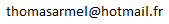

# Thomas Prévost

#### PhD student in cryptography

- :fr: French
- :red_car: Driving-license
- TOEIC 905/990
- https://github.com/thomasarmel
- https://www.linkedin.com/in/thomas-prevost1/
- 

### Education

#### PhD in cryptography
*2023 - today | I3S, Université Nice Côte d'Azur, France*

> Integration of Quantum Key Distribution algorithms into a software libraryIntegration of Quantum Key Distribution algorithms into a software library

#### Engineering degree in Computer Science, Cyber Security
*2020 - 2023 | Polytech Nice Sophia Antipolis, France*

#### Master in Management and Business Administration
*2022 - 2023 | IAE, Université Nice Côte d'Azur*

### Professional experience

#### Teacher
*2023 - today | I3S, Université Nice Côte d'Azur, France*

> Lab teacher for pentest and web securityLab teacher for pentest and web security

#### DevSecOps Cloud OpenBackend C++

*2021 - 2023 | Amadeus, Villeneuve-Loubet, France | Apprenticeship*

> Within Amadeus, world leader in the Global Distribution System (GDS) for airline tickets, I had the opportunity to perform the function of DevOps Cloud C++.

> Assigned to a team in charge of booking optional airline ticket services (SSR), I worked on the maintenance of the backend in the C++ language. I also participated in the migration to the Azure Cloud of services, through missions oriented around cybersecurity.

#### Integration of bio-inspired AI algorithms such as Spikes neural networks

*2021 | LEAT, Sophia Antipolis, France | Internship*

> I had the unique opportunity, within the Electronics, Antennas and Telecommunications Laboratory (LEAT), to work on the integration of bio-inspired neural networks of Spike neural network types. Within the laboratory, at the forefront of the field, I had the opportunity to discover the culture of scientific research.

#### Project manager

*2020 - 2021 | Polytech Nice Conseil, Sophia Antipolis, France*

> Project manager within the “Junior Creation” Polytech Nice Conseil

### Contests

- Battle dev, november 2019
- Nuit de l'info, december 2019
- Google Hash Code, 2020
- Battle dev, 2020
- Hackaton Electronie, 2020
- Coding battle, 2020
- Battle dev, 2020
- Google Hash Code, 2020
- Battle dev, 2021
- Coding battle, 2021
- Google Hash Code, 2022

### Interests

- Swimming
- Hiking
- Badminton
- Programming